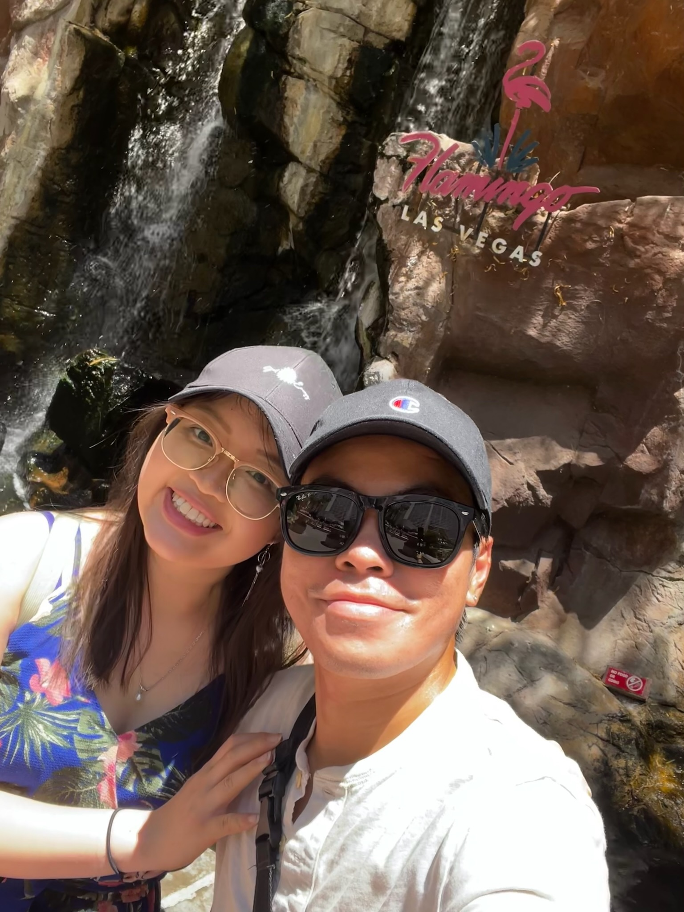

::: {.grid}

::: {.g-col-12 .g-col-md-12 style="text-align: center"}

## Countdown:{#home}

---

:::

::: {.g-col-12 .g-col-md-6 .material-card .image-fill}

{.img-fluid}

:::

::: {.g-col-12 .g-col-md-6 .material-card}

## Details{#details}

---

_Date_
\
**Sunday, Dec 6th, 2026**

---

_Time_
\
**3:00 PM to 9:00 PM**

---

_Dress Code_
\
**Semi-Formal / Cocktail Attire**

---

_Registry_
\

Your presence at our wedding is the greatest gift of all! However, if you wish to honor us with a gift, a contribution toward our future together would be wonderful. **We will have a card box available at the reception for your convenience.** 
\

For those who prefer digital, our registry can be found below:
\

* [Link to Registry 1](#)
* [Link to Registry 2](#)

:::

::: {.g-col-12 .material-card}

## Location{#location}

---

#### Dove Canyon Courtyard

[31981 Dove Canyon Drive, Dove Canyon, CA  92679](https://www.google.com/maps?cid=6769603451629656288&g_mp=CiVnb29nbGUubWFwcy5wbGFjZXMudjEuUGxhY2VzLkdldFBsYWNlEAIYASAA&hl=en&gl=US&source=embed)
\

The ceremony and reception will both be held at the same location.

\
<iframe src="https://www.google.com/maps/embed?pb=!1m18!1m12!1m3!1d3321.582688824683!2d-117.5727888!3d33.642060799999996!2m3!1f0!2f0!3f0!3m2!1i1024!2i768!4f13.1!3m3!1m2!1s0x80dceb3d8b49e0ef%3A0x5df27678eca4d8e0!2s31981%20Dove%20Canyon%20Dr%2C%20Dove%20Canyon%2C%20CA%2092679!5e0!3m2!1sen!2sus!4v1776277867507!5m2!1sen!2sus" width="100%" height="400" style="border:0;" allowfullscreen="" loading="lazy" referrerpolicy="no-referrer-when-downgrade"></iframe>

<!-- <iframe src="https://www.google.com/maps/embed?pb=..." width="100%" height="400" style="border:0;" allowfullscreen="" loading="lazy" referrerpolicy="no-referrer-when-downgrade"></iframe> -->
:::

::: {.g-col-12 .material-card}

## Catering Menu{#catering}

---

::: {.callout-important collapse="false"}

Please let us know ahead of time if you have any dietary restrictions.

:::

**Cocktail Hour**\

* Selection A
* Selection B

**Appetizers - Stationed**\

* Crab Salad with Chips
* Veggie Egg Rolls
* Veggie Crudites

**Main Course**\

* Asian Charcuterie Plate
* Fish Maw & Crab Soup
* House Special Lobster with Garlic Noodles
* Filet Mignon Shaken Beef
* Honey Walnut Shrimp
* Peking Duck with Steamed Bun
* Fish Filet with Sweet Basil Sauce
* Classic House Special Fried Rice
* Dessert: Sliced Oranges & Longans

:::

::: {.g-col-12 .material-card}

## Frequently Asked Questions{#faqs}

---

::: {.callout-note collapse="false"}

### Is there parking at the venue?

Yes, there is a parking lot on-site.

:::

::: {.callout-note collapse="false"}

### Are kids welcome?

Yes, we love kids! But, please do indicate ahead in your RSVP if you are bringing kids.

:::

::: {.callout-note collapse="false"}

### Are pets welcome?

We love our furry friends! But, please note that our wedding is a pet-free event. We love your animals, but we kindly ask that you leave them at home so you can enjoy the celebration to the fullest.

:::

::: {.callout-note collapse="false"}

### What will the weather be like?

Expect Southern California weather! It should be warm during the day but might cool down in the evening, so we recommend bringing a light jacket or wrap.

:::

:::

::: {.g-col-12 .material-card}

## Contact Us{#contact}

---

If you have any questions that aren't covered in the FAQs, or need to reach out to us regarding your RSVP, please let us know!

##### Wai Phyo
**Phone:** (415) 692-8896
\
**Email:** [wphyo3820@gmail.com](mailto:wphyo3820@gmail.com)  

##### Kathleen Nguyen
**Phone:** (619) 902-9544
\
**Email:** [kathleen.wai0517@gmail.com](mailto:kathleen.wai0517@gmail.com)

##### Day of Wedding Contact
*If you're unable to reach us on the day of our wedding, please reach out to our coordinator / Maid of Honor / Best Man, [Name], at [Phone Number].*

:::

\

:::